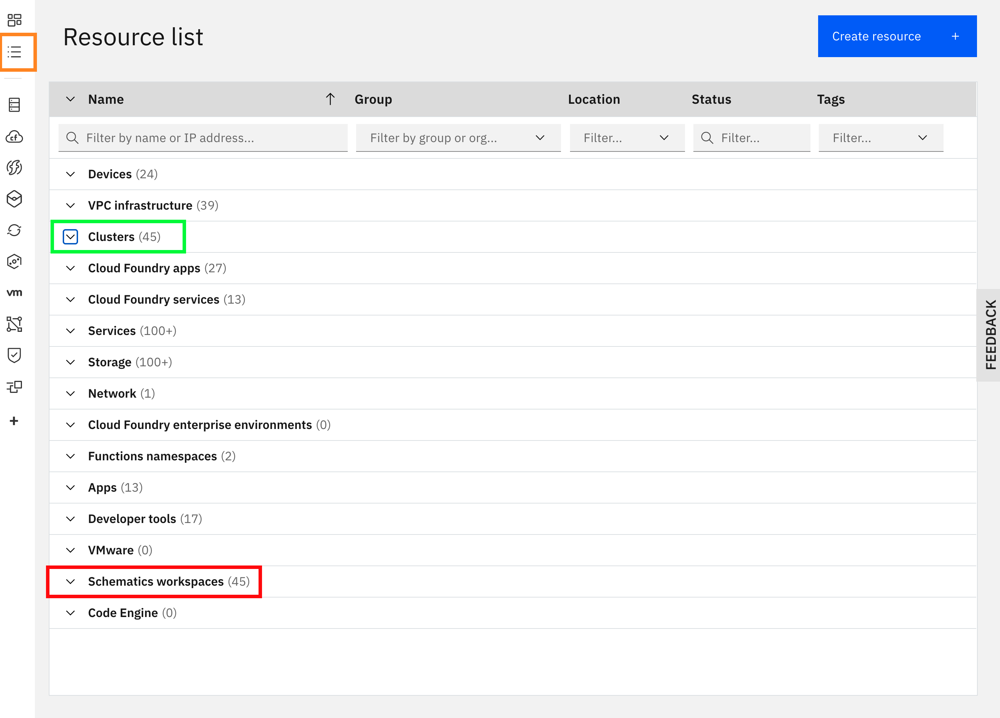

# Cloud Pak Sandbox User Installation Script

- [Cloud Pak Sandbox User Installation Script](#cloud-pak-sandbox-user-installation-script)
  - [Introduction](#introduction)
  - [Requirments](#requirments)
    - [Understanding the IBM Cloud Shell](#understanding-the-ibm-cloud-shell)
    - [Generate an IBM API key](#generate-an-IBM-API-key)
    - [Get Registry Key](#get-registry-key)
    - [Download the Script](#download-the-script)
    - [Create a resource group](#create-a-resource-group)
    - [CP4S requirments](#cp4s-requirments)
  - [Runing the Installer](#run-installer)
  - [Installing From Personal Device](#install-from-personal-device)
  - [VLAN Usage](#vlan-usage)
  - [Checking Progress](#checking-progress)
  - [Accessing the Cloud Pak Console](#accessing-the-cloud-pak-console)
  - [Deleting the Workspace and Resources](#deleting-the-workspace-and-resources)
  - [Clean Up Script](#Clean-up-script)
  - [Additional Information](#additional-information)

## Introduction

The Cloud Pak Sandbox Installer is an easy to use script that allows you to provision a ROKS cluster and install from a list of IBM Cloud Paks using the IBM Cloud Shell or your personal computer. This script creates a Schematics workspace that then executes Terraform scripts to create the necessary resources.

Currently you can run the script to install:

- Automation Foundation
- Cloud Pak for Multi Cloud Management
- Cloud Pak for Data
- Cloud Pak for Integration
- Cloud Pak for AIOps
- Cloud Pak for Security (local runtime installer only)
- Cloud Pak for Busincess Automation (under development)
- Cloud Pak for Network Automation (under development)

## Requirments

In order to run the cloud-pak-installer.sh script you must have a series of required input values, these are discussed below in the requirments.  Some modules may require additional requirments.  Cloud Pak for Security will require additional requirments which are listed below.

After the input values and tools are gathered you will need decide to run the cloud pak installer from your local machine or the IBM Cloud Shell.  CP4S must be run from your local machine.  In either case you will clone the repo, add permission to the script if needed, and run cloud-pak-installer.sh

### Understanding the IBM Cloud Shell

Running the cloud-pak-installer on IBM Cloud Shell is a simple process and has all the required tools installed, follow this link for more info on the IBM Cloud Shell
[Understanding the IBM Cloud User Interface](https://cloud.ibm.com/docs/overview?topic=overview-ui)

### Generate an IBM API key

When install cloud paks, some require an api key and any type of VPC, IAF, and Portworx combination will also require an api key.  To generate the API key you can log into your IBM account and go to this link.

[IBM Cloud IAM API key](https://cloud.ibm.com/iam/apikeys)

### Get registry key

Each Cloud Pak requires an entitlement key. The script will prompt for this key and the email associated with it to install any of the Cloud Paks.

If you do not have the key visit this link to generate one:
[Generate Cloud Pak Entitlement Key](https://myibm.ibm.com/products-services/containerlibrary)

NOTE: For Cloud Pak for Data you will also need your docker credentials if installing the Guardium External Strap module.

### Download the script

Log in to your [IBM Cloud](http://cloud.ibm.com) account and click the terminal icon in the upper right corner of IBM Cloud console to open the **IBM Cloud Shell**

Within the **IBM Cloud Shell** terminal, clone the following repo:

     git clone https://github.com/ibm-hcbt/cloud-pak-sandboxes

### Create a resource group

In order for the script to run it requires a resource group to work out of as well as for the user to have permissions to that group. The cloud-pak-installer.sh will prompt for the resource group.  If one is not provided or if the provided one is not found the script will fail with the appropriate error.

Note: Be sure that you have permission to the resource group you are using.  If you do not have permission this is the same as the resource group not existing to the cloud-pak-installer.sh

### CP4S Requirments

Cloud Pak for Security requires docker images running locally to install the cloud pak.  Due to this when installing CP4S you must run the installer from a local machine with docker permissions.  In addition you will need to be sure the following command line tools are enabled.

[CP4S Requirments](https://www.ibm.com/docs/en/cloud-paks/cp-security/1.6.0?topic=tasks-installing-developer-tools)

## Run installer

To run the installer, do the following in the **IBM Cloud Shell** terminal:

    cd cloud-pak-sandboxes/cloud-pak-installer
    chmod +x cloud-pak-installer.sh
    ./cloud-pak-installer.sh

From here the Installer will ask you a set of questions pertaining to the cluster you wish to create.  The cloud-pak-installer.sh will take about 15 minutes to run, when it is finished a workspace schematic will be created to manage the creation of an openshift cluster and cloud pak install.  Depending on selection the creation of the resources can take anywhere from 1-3 hours this can go even longer when choosing mutiple modules.

The cloud-pak-installer.sh will return a link that you can go to and monitor the install.

## Install From Personal Device

To run this Installer on your local machine:

1. Ensure that [IBM Cloud CLI](https://cloud.ibm.com/docs/cli?topic=cli-install-ibmcloud-cli) is installed

2. Ensure that the [IBM Schematics Plug-in](https://cloud.ibm.com/docs/schematics?topic=schematics-setup-cli) is installed

   `ibmcloud plugin install schematics`
3. Log into the ibm cloud

   `ibmcloud login -sso`
4. Ensure that you are in the desired account and resource group

   `ibmcloud target`

5. Go to your working directory and follow the same instructions for running in IBM Cloud Shell:

- [Get Registry Key](#get-registry-key)
- [Download the Script](#download-the-script)
- [Run Installer](#run-installer)

## VLAN Usage

In order for the Installer to create a ROKS cluster there must be a public and private VLAN available to the Datacenters you plan to build to.  No worries if you do not know how to manage VLANS becuase the installer script will handle that for you.  

While running the installer you will be prompted for region and datacenter. Once selected the installer will automatically check available VLANs for use.  If there are not existing VLANS, script will prompt to create them.

Finally, once a VLAN is created it will take some time until it is ready for use. This time varies based of the availablity of resources at the datacenter and can take anywhere from a few seconds to several minutes.

## Checking Progress

To check the status of the workspace:

### 1. Log in to [IBM Cloud](http://cloud.ibm.com) account
### 2. Select "Schematics workspaces" from the resource menu on top left column of IBM Cloud Console

The image below shows the button for the resource list (orange box), as well as the two menu locations to find the cluster (green box) when the workspace finishes, and the workspace (red box) which you can follow while the script runs. 

NOTE: User may need permissions to view workspace schematics. Contact account administrator if restricted.

### 3. Click to open your workspace
All workspaces and clusters made with this tool will end in "-sandbox"

The workspace will look like this. The "activity" button and the "workspaceid" are marked. You can also view the variables entered when using the script:

Within the **Schematic workspace** select **Activity** from left menu. Select **View log** link from **Plan applied** row, as shown in the image below:

## Accessing the Cloud Pak Console

The workspace activity plan logs will print out the Cloud Pak console *url*, *username* and *password* once the installation is complete. 

**IMPORTANT:** Once the cloud pak has been installed and the admin/password credentials are provided, please change the password immediately.  

## Deleting The Workspace and Resources

There are two methods to delete resources. Use the manual steps or look at the [Clean Up Script](Clean Up Script)

### 1. Log in to your [IBM Cloud](http://cloud.ibm.com) account
### 2. Select "Schematics workspaces" from the resource menu on top left column of IBM Cloud Console

The image below shows the button for the resource list (orange box), as well as the two menu locations to find the cluster (green box) when the workspace finishes, and the workspace (red box) which you can follow while the script runs. 

NOTE: You will need permissions to view workspace schematics.

### 3. Click "Delete" from the 3 dot menu on the right of your workspace
All workspaces and clusters made with this tool will end in "-sandbox"

Select `Delete workspace` and `Delete all associated resources` options, type the name of the workspace and select `Delete`.  This should issue a "terraform destroy" command to delete all resources that were created by the "terraform apply".  

**NOTE:** If the workspace fails to delete, the Terraform state is out of sync.  Attempt deletion again but only select `Delete workspace` option.  Resources may then need to be manually deleted.

## Clean Up Script

An alternative to deleting cluster and schematics is to use [cloud-pak-sandboxes/scripts/delete-schematics](https://github.com/ibm-hcbt/cloud-pak-sandboxes/scripts/delete-schematics).

To use this script you must first be logged into the IBM cloud bash shell or the IBM cloud cli if running from your computers bash.  After that run the delete-schematics and you will be prompted with instructions on what you would like to delete. Simply choose the options and delete.

This does not have a catch and will immediatly delete selected options. Be carefull as to whats you select.

## Additional Information

Here is some additional documentation pertaining to the various technologies involved with the Sandbox environment

Cloud Pak Sandbox Installer [README](https://github.com/ibm-hcbt/cloud-pak-sandboxes/blob/master/installer/README.md) (this document)

Cloud Pak Sandbox environment [Terraform modules](https://github.com/ibm-hcbt/terraform-ibm-cloud-pak)

Cloud Pak Sandbox environment [Terraform scripts](https://github.com/ibm-hcbt/cloud-pak-sandboxes/blob/master/terraform)

Cloud Pak for Applications [Documentation](https://www.ibm.com/cloud/cloud-pak-for-applications) 

Cloud Pak for Applications [Sandbox Inputs/Outputs and Validation](https://github.com/ibm-hcbt/cloud-pak-sandboxes/blob/master/terraform/cp4app/README.md) 

Cloud Pak for Data [Documentation](https://www.ibm.com/products/cloud-pak-for-data) 

Cloud Pak for Data [Sandbox Inputs/Outputs and Validation](https://github.com/ibm-hcbt/cloud-pak-sandboxes/blob/master/terraform/cp4data/README.md) 

Cloud Pak for Integration [Documentation](https://www.ibm.com/cloud/cloud-pak-for-integration) 

Cloud Pak for Integration [Sandbox Inputs/Outputs and Validation](https://github.com/ibm-hcbt/cloud-pak-sandboxes/blob/master/terraform/cp4int/README.md) 

Cloud Pak for Multi Cloud Management [Documentation](https://www.ibm.com/cloud/cloud-pak-for-management) 

Cloud Pak for Multi Cloud Management [Sandbox Inputs/Outputs and Validation](https://github.com/ibm-hcbt/cloud-pak-sandboxes/blob/master/terraform/cp4mcm/README.md) 

[IBM Cloud CLI](https://cloud.ibm.com/docs/cli?topic=cli-install-ibmcloud-cli)

[IBM Cloud Shell](https://www.ibm.com/cloud/cloud-shell)

[IBM Cloud Console](https://cloud.ibm.com/docs/overview?topic=overview-ui)

[IBM Schematic Workspaces](http://github.com)

[RedHat OpenShift Kubernetes Services/(ROKS)](https://developer.ibm.com/recipes/tutorials/planning-redhat-openshift-deployment-on-ibm-cloud/)
